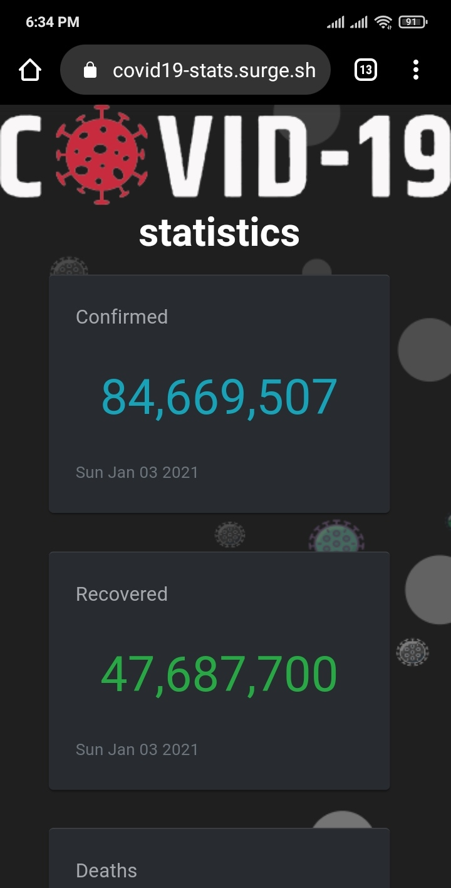
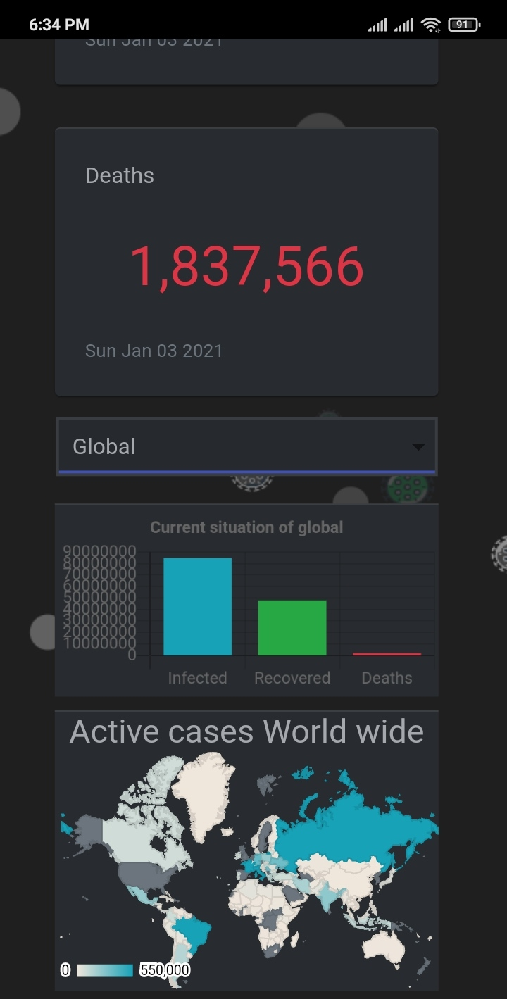
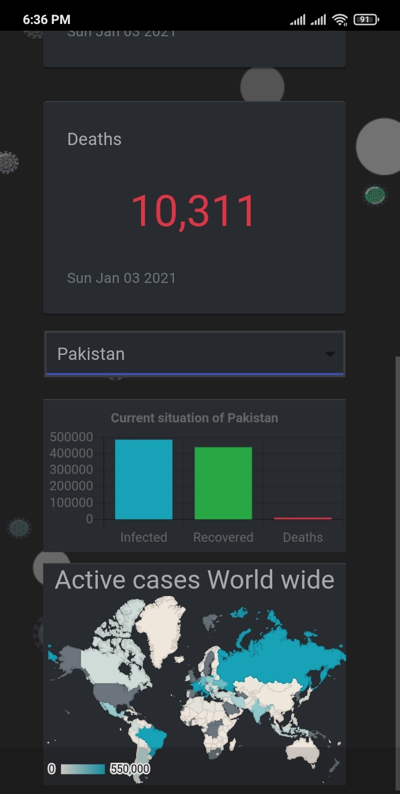

# Covid-19 Tracker

[Click here to test](https://covid19-stats.surge.sh/)

It is covid-19 tracker app built on **Reactjs** <code></code> that displays stats about covid.

# Features

- **Updated Everyday** (The stats are updated in every 24 hours)
- **Country Seclection** (you can see ststs of any country by selecting certain country from country selector)
- **Trend Graph** (display's trend of infected as well as deaths)
- **World Map Based Chart** (you can see where covid-19 is delting more damage in the world)

## Screenshots

  
